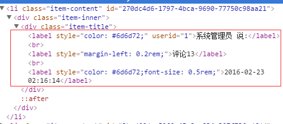
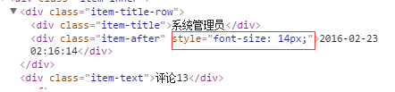
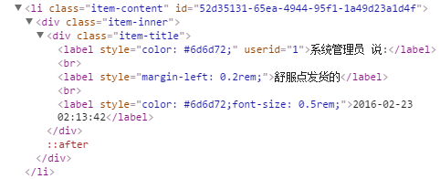

# MSUI练习 中发现的一些问题
1 注意标签语义化，如图



> [MDN 中对 "<label>" 的解释(英文)](https://developer.mozilla.org/en-US/docs/Web/HTML/Element/label)

> [MDN 中对 "<label>" 的解释(中文)](https://developer.mozilla.org/en-US/docs/Web/HTML/Element/label)

2 可优化代码
```
for (var i = 0; i < len; i++) {
    html += '<li class="item-content" id="' + rows[i].id;
    html += '"><div class="item-inner" >';
    html += '<div class="item-title">';
    html += '<label style="color: #6d6d72;" userId="' + rows[i].userId + '">';
    html += rows[i].cnName;
    html += ' 说:</label><br /><label style="margin-left: 0.2rem;">';
    html += rows[i].content;
    html += '</label><br /><label style="color: #6d6d72;font-size: 0.5rem;">';
    html += rows[i].date;
    html += '</label></div></div></li>';
}
```

 这样看起来会有点困难,建议合并为一个html+=就好。
 保留html元素缩进，比较直观

 类似这样的结构:
 ```
 html +='<li class="item-content" createTime="'+ rows[i].createTimeStr +'">' +
           '<div class="item-inner">' +
               '<div class="item-title">' + rows[i].title +'</div>' +
           '</div>' +
         '</li>';
 ```

3 style 在实际开发中要尽量与html 分离，不宜直接写在标签上,选择新建一个CSS

4 font-size 不要以rem 为单位。
   具体原因: 部分手机高清屏下经过rem 缩放会导致字体矩阵异常，出现字体模糊问题
   

5 敏感数据不宜暴露在标签上。




